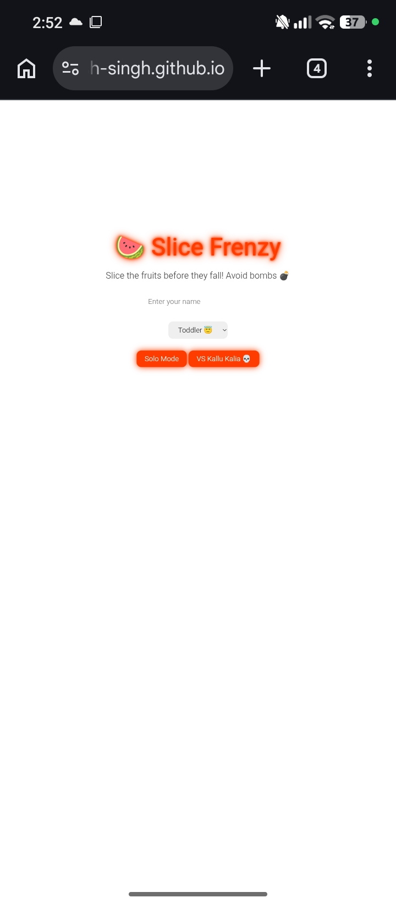
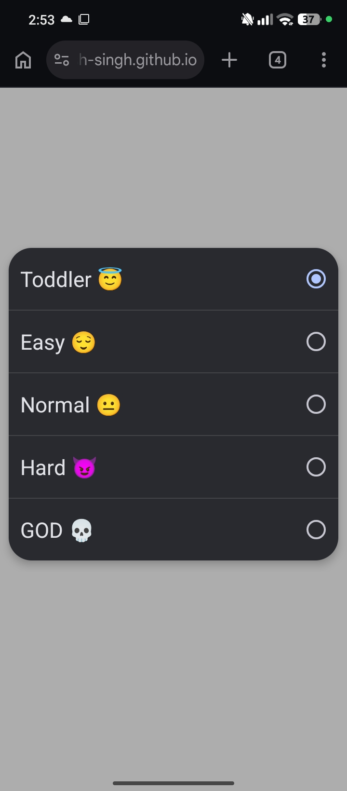
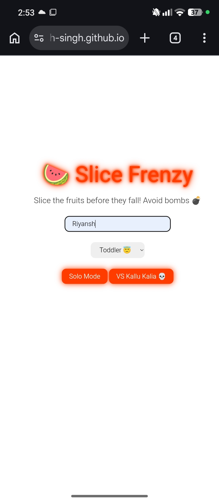
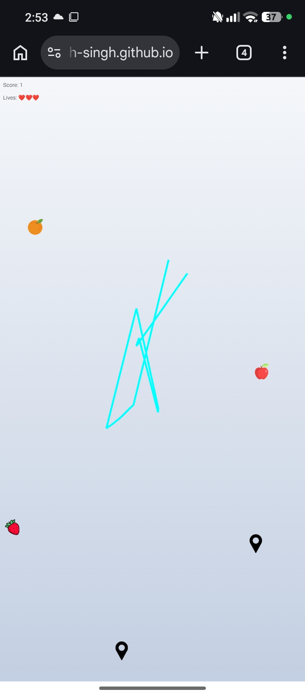
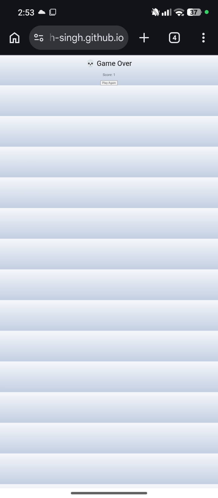

# Slice Frenzy – Kallu Kalia Edition (Dark Mode)

**Slice Frenzy** is a dark-mode, neon-style fruit slicing game built with HTML, CSS, and JavaScript. The game challenges players to slice fruits while avoiding bombs, with visually satisfying blade trails, particle effects, and immersive sound. It works smoothly on both desktop and mobile devices.  

This dark-mode edition features a neon arcade aesthetic that makes fruits, blade trails, and particles pop on the screen. Players can enjoy solo mode or play against a bot (“Kallu Kalia”) for a fun challenge.

---

## Project Overview

I created Slice Frenzy to explore interactive web-based game development by combining:  

- **Real-time graphics**: Blade trails, particle effects, and dynamic fruit movement.  
- **Responsive controls**: Works with mouse or touch input.  
- **Dynamic gameplay**: Multiple difficulty levels to challenge players of all skill levels.  
- **Engaging visuals**: Neon dark-mode styling for an arcade feel.  
- **Sound integration**: Real-time audio feedback for actions and background music.  

This project demonstrates how web technologies can deliver smooth, interactive gaming experiences without relying on heavy frameworks.

---

## Features

- **Dark Mode Only**: Neon glowing visuals and text for an arcade-style experience.  
- **Blade Trail**: Smooth, responsive swipe following cursor or finger movement.  
- **Fruits & Bombs**: Randomly spawning fruits to slice and bombs to avoid.  
- **Difficulty Levels**:  
  - Toddler 😇: Very slow and easy to slice.  
  - Easy 😌: Slightly faster.  
  - Normal 😐: Moderate pace.  
  - Hard 😈: Fast-paced slicing.  
  - GOD 💀: Maximum speed for hardcore challenge.  
- **Game Modes**:  
  - Solo: Slice fruits yourself.  
  - VS Bot: Placeholder mode for playing against “Kallu Kalia”.  
- **Sound Effects**: Slice and bomb sounds for satisfying feedback.  
- **Background Music**: Looped track for immersive gameplay.  
- **Mobile-Friendly**: Fully responsive canvas supporting touch gestures.  
- **Particle Effects**: Slice fruits to generate dynamic visual particles.  

---

## Gameplay Instructions

1. Enter your name (optional) on the start screen.  
2. Select a difficulty level.  
3. Choose a game mode: Solo or VS Bot.  
4. Slice fruits by swiping your finger or moving the mouse over them.  
5. Avoid bombs — hitting a bomb ends the game immediately.  
6. Score points for every fruit sliced.  
7. Game ends when lives run out or a bomb is hit.  
8. Click “Play Again” to restart the game.  

---

## Technical Details

- **Languages & Libraries**: HTML5, CSS3, Vanilla JavaScript  
- **Canvas**: Handles drawing fruits, bombs, blade trails, and particles efficiently.  
- **Game Loop**: Implemented using `requestAnimationFrame()` for smooth animations.  
- **Event Handling**: Mouse and touch events detect blade position and collisions.  
- **Dynamic Fruit Spawn**: Random positions and speeds adjusted per difficulty level.  
- **Audio Integration**: Slice and bomb sounds triggered on interaction; background music loops automatically.  
- **Online Assets**: All images and sounds are loaded online for instant play.  

---

## Screenshots

## Gameplay Preview

---

## Live Demo

Try the game online: [Slice Frenzy Live](https://riiyansh-singh.github.io/slice-frenzy/)

---

## Assets

- **Fruit & Bomb Images**: Flaticon  
- **Sound Effects**: SoundJay  
- **Background Music**: SoundHelix  

> ⚠️ Currently, all assets are loaded online to make the game playable immediately. Future updates may include local assets for offline support.

---

## Future Enhancements

- Fully functional **VS Bot slicing AI**  
- More fruit types, bomb variations, and special power-ups  
- Enhanced neon glow effects on blade trails and particle explosions  
- High score tracking using local storage or a leaderboard  
- Offline asset support  

---

## Credits

- **Fruit & Bomb Images**: Flaticon  
- **Sound Effects**: SoundJay  
- **Background Music**: SoundHelix  

---

**Enjoy slicing fruits and beware of Kallu Kalia! 🍉💀**
